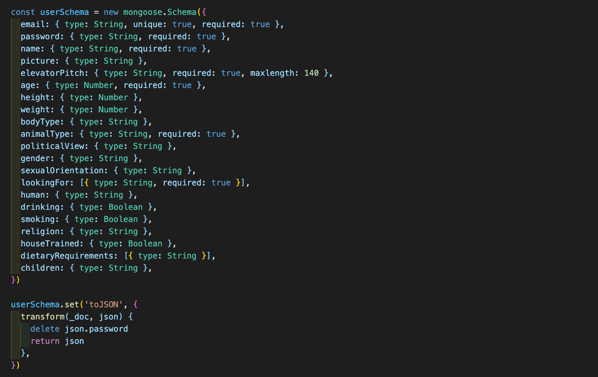
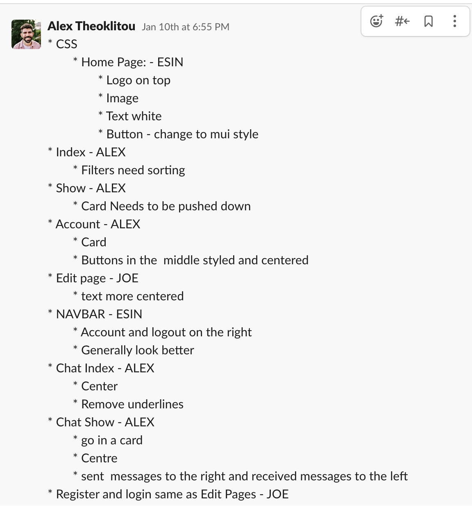

# Overview

### Team Members
[Esin Yilmazbilek](https://github.com/EsinYilmazbilek)
[Alex Theoklitou](https://github.com/alextheoklitou)
[Joe Freeman](https://github.com/joefreeman8)

For the third and the biggest project of the course, we were put in groups of 3 to build a full stack MERN application with CRUD functionality.

We decided to put some fun into our biggest project so far and build a dating app for our furry friends. After we came up with it’s name, SNIFF, and called ourselves the SNIFFERS, we started designing the app. SNIFF is a fully functioning app where users can register their account, put details of themselves on their profile and use multiple filters and selections to narrow down their search. Once they have the list of potential sniffs based on their criteria, users can view other profiles and start a private chat with them. 

Please note that user authentication is required, anyone interested in viewing the app is welcome to use these credentials:
Email: scrat@email
Password: pass

# Brief:
1. Build a full-stack application by making your own backend and your own front-end.
3. Build and use an Express API to serve your data from a Mongo database.
3. Be a complete product with multiple relationships and CRUD functionality and have multiple models.

# Deployment
The app has been deployed with Netlify and is available [here](https://sniff-project-three.netlify.app/).

# Timeframe
7 days

# Goal
* To build a full stack application for a dating app with multiple components.

# Technologies Used
* MUI 
* CSS
* Node.js
* Express
* MongoDB
* Mongoose
* JavaScript
* React
* JWT
* Bcrypt
* Axios
* GitHub
* Git

# Process
### Planning:
On day 1, we started with brainstorming and sketching out ideas on the layout and features of the app. 

First, we planned the main and stretch goals which helped us with designing the general layout of the individual pages. 

Some of the main components of the website are the home page which acts as a landing page, an index page which shows potential sniffs, account view page, and the chat page.

### Build:
Throughout the project we did daily stand-ups to share our progress and plan ahead. We kept a Zoom call on during the day which kept us in constant communication, and used Slack to share notes. 

As a group of 3 coders, while we all actively participated on both back and front end components of the app, we each had parts where we took further responsibility for. 

### Back end:
We worked on our parts individually and often merged together using Git. 

1. As first steps on the back end, we assigned components to each of us, and some were left to do as a group with everyone’s input. 

2. Backend models for the user and chat were built with Mongoose Schema. We used Mongoose unique validator for pre-save validation within our Mongoose schemas and bcrypt for encrypting user passwords.

3. I worked on building the controllers for the users and chat, and creating functions such as adding, editing, deleting, as well as creating, deleting messages and chat.

4. We wanted the features of this app to be available only to registered users, therefore we needed to build secure routes. Joe took over the task and implemented secure routes for all the channels excluding the home page, login and register pages.

5. In order for these secure routes to work, we wrote a function that confirms that there is a valid token obtained at the login stage, and it authorised the users accordingly.

6. After the planning process, completing the back end took around a day and a half. However, we came back occasionally to keep adding to our users database as such:

### Front end:

1. On the front end, we made a list of components then separated them into three main sections for each of us. 

2. I worked on building the landing page, navbar, and collaborated with Alex on the chat components.

3. Register & Login pages, and the Account page where the users can view, edit, and delete their profiles were built by Joe. 

4. For a better user experience, we wanted to allow the users to be able to directly login into their accounts after registering, rather than being taken to the login page to put the credentials again. Therefore we matched the data from the register form with the existing profiles and saved it to the local storage.

5. For the chat components, the important part was extracting the right data, ids and authenticating the user. We used React useState to retrieve data from our API and see all the chats.

6. React useState was also used for individual chats as well to get the correct data and use it accordingly. 
The interval you can see on the snippet below is for the show purposes during our project presentation, where it updates the content and displays the messages of the receiver and the sender. 

Screenshots of the chat feature:

7. One of the features we added was deleting individual messages and eventually the whole chat itself between different users.

8. We also wanted the users to be able to edit and delete their accounts if they wish to.

9. One of the sections I am personally proud of is the multiple filter options users can use. After we made a list of all the filters to add, everything from political view to being house trained (you know, the essentials) our group member Alex built the code to have the filters function together.

10. As we completed the steps on a daily basis, we updated our to-do lists over Slack as such:

11. For styling, we divided the workload between ourselves and I used a combination of CSS and MUI on the homepage and the responsive navbar with burger menu that conditionally renders the navbar items if a user is logged in or not.

# Challenges
* Designing and building a full stack app in 7 days was the biggest challenge so far. While it gave us full control over the app, it was a learning opportunity to build the individual components ourselves. 
* One of minor challenges was being able to use a Cloudinary account for the images users upload upon registering their accounts. We had some issues with this and ended up cropping the images we were to upload manually. 
* We realised that MUI components weren’t always the most practical to use so we used a combination of MUI and CSS.

# Wins
* Having our work planned per each day helped us stick to a plan and remain focused even when we were facing challenges.
* Working as a part of a group and supporting each other throughout the stages was very valuable.
* Reaching our MVP within the project timeframe and having a strong user journey was our desired outcome.

# Future Improvements
1. On the index page I would like to fix the varied profile card heights and have them all unified. 
2. I would like to implement a functionality where the users can ‘favourite’ their potential Sniffers and have them on a list.
3. Adding further error handling.

# Key Learnings
* This was the first time I built a navbar that responds to user authentication and screen size.
* Working on the chat components and retrieving & storing the user and chat ids was an important learning experience.
* Importance of daily standups and regular communication was important throughout the duration of the project.
* With each member having their main responsibility, I could work on a component by myself and try to fix issues as they arose. This also gave us the opportunity to help each other when we were stuck and work through the problems.
